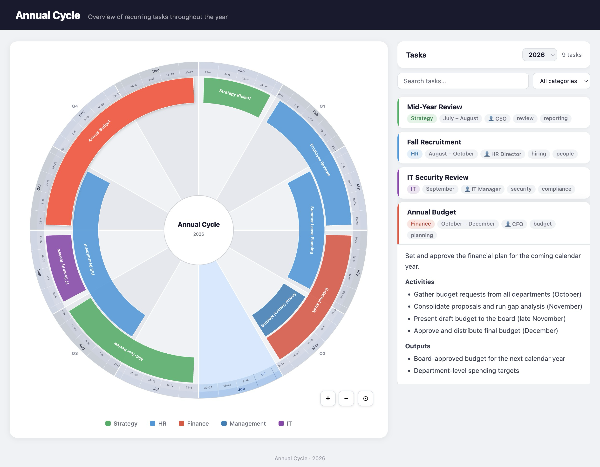

# Annual Cycle

An interactive wheel visualization for recurring annual tasks. Create a GitHub repository with a `tasks/` folder, add two workflow files, and you get a live site on GitHub Pages — automatically rebuilt every time you update your tasks.



## Features

- **Calendar wheel** — 12 months divided into 52 ISO weeks, with task arcs spanning their active period
- **Month or week precision** — schedule tasks by month or down to a specific ISO week range
- **Automatic ring placement** — overlapping tasks are separated into concentric rings automatically
- **Category colors** — tasks grouped and colored by category
- **Search & filter** — live text search and category filter in the sidebar
- **Zoom & pan** — scroll, pinch, drag, or use the +/− buttons to explore the wheel
- **Embeddable iframe** — a wheel-only build (`iframe.html`) ready to embed in any page
- **Slack digests** — weekly/monthly/quarterly task reminders via a GitHub Actions workflow

---

## Quick start

### 1. Create your repository

Create a new GitHub repository (any name). You do not need to fork or copy this project — everything is pulled in automatically at build time.

### 2. Enable GitHub Pages

Go to **Settings → Pages** in your new repository and set **Source** to **GitHub Actions**.

### 3. Add the deploy workflow

Create `.github/workflows/deploy.yml` in your repository with the following content (or copy it from [`examples/workflows/deploy.yml`](examples/workflows/deploy.yml)). If you'd rather self-host the build instead of using GitHub Pages, see [Build without deploying to GitHub Pages](#build-without-deploying-to-github-pages) below.

```yaml
name: Deploy Annual Cycle

on:
  push:
    branches: [main]
    paths:
      - 'tasks/**'
      - '.github/workflows/deploy.yml'
  workflow_dispatch:

permissions:
  contents: read
  pages: write
  id-token: write

concurrency:
  group: pages
  cancel-in-progress: false

jobs:
  deploy:
    runs-on: ubuntu-latest
    environment:
      name: github-pages
      url: ${{ steps.build-deploy.outputs.page_url }}
    steps:
      - uses: actions/checkout@v4
      - id: build-deploy
        uses: eliihen/annual-cycle/.github/actions/build-deploy@main
```

### 4. Add your first task

Create a `tasks/` folder in your repository and add a Markdown file (see [Adding tasks](#adding-tasks) below). Commit and push — the site deploys automatically.

Your site will be live at `https://<your-username>.github.io/<your-repo>/`.

---

## Adding tasks

Create one `.md` file per recurring task inside your `tasks/` directory. The filename becomes the task ID.

### Month-based task

```yaml
---
title: Annual Budget
start_month: 10
end_month: 12
category: Finance
responsible: CFO
priority: high
tags: [budget, planning]
---

Describe the task in Markdown here.
This content appears in the sidebar when you click the arc.
```

### Week-based task

```yaml
---
title: Q1 Business Review
start_week: 11
end_week: 13
category: Strategy
responsible: CEO
---
```

`start_week` and `end_week` use ISO 8601 week numbers (1–52). When present, month fields are ignored.

### All frontmatter fields

| Field | Type | Required | Description |
|---|---|---|---|
| `title` | string | yes | Display name |
| `start_month` | 1–12 | month tasks | First active month |
| `end_month` | 1–12 | month tasks | Last active month |
| `start_week` | 1–52 | week tasks | First active ISO week |
| `end_week` | 1–52 | week tasks | Last active ISO week |
| `category` | string | no | Groups tasks by color |
| `responsible` | string | no | Person shown on the card |
| `responsible_slack_handle` | string | no | Slack handle — tagged with `@` in Slack digests |
| `priority` | low / medium / high | no | For reference only |
| `tags` | list | no | Shown as chips on the card |
| `color` | hex string | no | Overrides the category color |
| `repeat` | string | no | Repeat cadence — see below |

### Repeating tasks

Add `repeat` to any task to place it multiple times around the wheel and include all instances in Slack digests.

**Week-based tasks:**

| Value | Interval |
|---|---|
| `weekly` | Every week |
| `biweekly` | Every 2 weeks |
| `monthly` | Every 4 weeks |
| `tertial` | Every 17 weeks (3× per year) |
| `quarterly` | Every 13 weeks |

**Month-based tasks:**

| Value | Interval |
|---|---|
| `monthly` | Every month |
| `quarterly` | Every 3 months |
| `tertial` | Every 4 months (3× per year) |
| `biannual` | Every 6 months |

Example — a 1-week task that repeats every month starting in week 3:

```yaml
---
title: Monthly Planning
start_week: 3
end_week: 3
repeat: monthly
category: Management
---
```

This produces arcs at weeks 3, 7, 11, 15, 19, 23, 27, 31, 35, 39, 43, 47.

See [`examples/tasks/`](examples/tasks/) for ready-to-use sample files.

### Category colors

Built-in color mappings:

| Category           | Color                  |
| ------------------ | ---------------------- |
| Finance            | Red `#E74C3C`          |
| HR                 | Blue `#3498DB`         |
| Strategy           | Green `#27AE60`        |
| Management         | Dark blue `#2980B9`    |
| IT / Technology    | Purple `#8E44AD`       |
| Marketing          | Orange `#E67E22`       |
| Sales              | Yellow `#F39C12`       |
| Operations         | Teal `#16A085`         |
| Compliance / Legal | Dark red `#C0392B`     |
| Communication      | Burnt orange `#D35400` |

Any other category name gets a deterministic color derived from its name.

---

## Slack notifications (optional)

Get a Slack digest every Monday with the tasks active that week, month, and quarter.

### Setup

1. Create a Slack incoming webhook at <https://api.slack.com/messaging/webhooks>
2. Add it as a repository secret named `SLACK_WEBHOOK_URL` (**Settings → Secrets → Actions → New repository secret**)
3. Create `.github/workflows/notify-slack.yml` (or copy [`examples/workflows/notify-slack.yml`](examples/workflows/notify-slack.yml)):

```yaml
name: Annual Cycle – Slack Notification

on:
  schedule:
    - cron: '0 7 * * 1'   # Every Monday at 07:00 UTC
  workflow_dispatch:
    inputs:
      period:
        description: 'Period to notify for (week / month / quarter / all)'
        required: false

jobs:
  notify:
    runs-on: ubuntu-latest
    steps:
      - uses: actions/checkout@v4
      - uses: eliihen/annual-cycle/.github/actions/notify-slack@main
        with:
          slack_webhook_url: ${{ secrets.SLACK_WEBHOOK_URL }}
          period: ${{ inputs.period || '' }}
```

You can also trigger a one-off notification manually from **Actions → Annual Cycle – Slack Notification → Run workflow**.

---

## Embedding the wheel (iframe)

Every build also produces an `iframe.html` alongside `index.html`. It contains only the wheel — no header, sidebar, or footer — making it suitable for embedding in intranets, Notion pages, or dashboards.

```html
<iframe
  src="https://<you>.github.io/<your-repo>/iframe.html"
  width="600"
  height="600"
  style="border: none;">
</iframe>
```

Clicking a task arc in the iframe navigates the top-level frame to your full site. This link target is baked in at build time and is set automatically from your repository name. See [Advanced configuration](#advanced-configuration) if you use a custom domain.

---

## Using the React library

The wheel is also published as a React component library on npm, so you can render it inside your own React app instead of (or alongside) the GitHub Pages deployment.

```bash
npm install @eliihen/annual-cycle
```

`react` and `react-dom` (v19+) are peer dependencies — you provide them from your own app.

### Render the wheel

The library exports the `Wheel` component and the `processTasks` helper. `Wheel` takes an array of already-processed tasks; `processTasks` turns raw Markdown modules into that array (computing fractional positions, ring assignment, repeat expansion, and category colors).

```jsx
import { useMemo, useState } from 'react';
import { Wheel, processTasks } from '@eliihen/annual-cycle';

// Task modules, keyed by path, each shaped `{ frontmatter, html }` —
// see "Load your own tasks" below for how to produce these.
import taskModules from './my-tasks.js';

export function AnnualCycle() {
  const tasks = useMemo(() => processTasks(taskModules), []);
  const [activeId, setActiveId] = useState(null);
  return (
    <Wheel
      tasks={tasks}
      activeId={activeId}
      onTaskClick={setActiveId}
      year={new Date().getFullYear()}
    />
  );
}
```

### Load your own tasks

`processTasks` expects an object shaped like the output of Vite's [`import.meta.glob`](https://vite.dev/guide/features.html#glob-import) after each Markdown file has been transformed to `{ frontmatter, html }` — the "import on demand based on a configured path" mechanism. The library ships the same Markdown transform it uses internally as a Vite plugin, so you can point it at *your own* tasks directory:

```js
// vite.config.js
import { defineConfig } from 'vite';
import react from '@vitejs/plugin-react';
import { markdownPlugin } from '@eliihen/annual-cycle/vite-plugin';

export default defineConfig({
  plugins: [react(), markdownPlugin()],
});
```

```js
// my-tasks.js — glob your own Markdown files from wherever they live
const taskModules = import.meta.glob('./content/tasks/*.md', { eager: true });
export default Object.fromEntries(
  Object.entries(taskModules).map(([path, mod]) => [path, mod.default]),
);
```

Each `tasks/*.md` file uses the same frontmatter fields documented under [Adding tasks](#adding-tasks). If your build tool isn't Vite, transform each Markdown file into `{ frontmatter, html }` yourself (e.g. with `gray-matter` + `marked`) and hand the resulting map to `processTasks`.

> **Styling:** `Wheel` renders inline SVG and carries no CSS import of its own. Copy the wheel-related rules from [`src/index.css`](src/index.css) (or [`src/iframe.css`](src/iframe.css) for the minimal variant) into your app's stylesheet to match the reference look.

---

## Advanced configuration

All advanced options are optional. The defaults work for standard GitHub Pages setups.

`build-deploy`, `build`, `deploy`, and `notify-slack` are [composite actions](.github/actions/), not reusable workflows — each is a single step you drop into your own job. That means you can freely add your own steps before or after them in the same job (checkout, custom build steps, a deploy-elsewhere step, notifications, etc.).

### Custom domain

If your site is served from a custom domain (e.g. `https://cycle.example.com/`), set `base_path` and `site_url` on the action:

```yaml
steps:
  - uses: actions/checkout@v4
  - id: build-deploy
    uses: eliihen/annual-cycle/.github/actions/build-deploy@main
    with:
      base_path: /
      site_url: https://cycle.example.com/
```

### Custom tasks directory

If your tasks live somewhere other than `tasks/`:

```yaml
steps:
  - uses: actions/checkout@v4
  - id: build-deploy
    uses: eliihen/annual-cycle/.github/actions/build-deploy@main
    with:
      tasks_path: content/annual-tasks
```

### Pinning to a specific version

Replace `@main` with a tag to pin to a stable release:

```yaml
uses: eliihen/annual-cycle/.github/actions/build-deploy@v1.0.0
```

### Build without deploying to GitHub Pages

`build-deploy` is a thin wrapper around two smaller composite actions,
[`build`](.github/actions/build/action.yml) and
[`deploy`](.github/actions/deploy/action.yml). If you want to host the static
site yourself (e.g. Netlify, S3, an internal server) instead of using GitHub
Pages, use `build` directly — it produces a `dist_path` output pointing at
the built site files, which you can upload as an artifact, sync to your own
host, or hand to any other step in the same job:

```yaml
jobs:
  build:
    runs-on: ubuntu-latest
    steps:
      - uses: actions/checkout@v4
      - id: build
        uses: eliihen/annual-cycle/.github/actions/build@main
        with:
          tasks_path: tasks
      - name: Sync to S3
        run: aws s3 sync ${{ steps.build.outputs.dist_path }} s3://my-bucket/ --delete
```

If you later decide you do want a GitHub Pages deploy, add a [`deploy`](.github/actions/deploy/action.yml) step right after `build` in the same job, passing along its `dist_path` output:

```yaml
jobs:
  deploy:
    runs-on: ubuntu-latest
    permissions:
      contents: read
      pages: write
      id-token: write
    environment:
      name: github-pages
      url: ${{ steps.deploy.outputs.page_url }}
    steps:
      - uses: actions/checkout@v4
      - id: build
        uses: eliihen/annual-cycle/.github/actions/build@main
      - id: deploy
        uses: eliihen/annual-cycle/.github/actions/deploy@main
        with:
          dist_path: ${{ steps.build.outputs.dist_path }}
```

This is exactly what `build-deploy` does internally. Note that composite
actions can't declare `permissions:` or `environment:` themselves — your job
must set those, as shown above.

---

## Local development

Clone this repository if you want to develop the visualization itself:

```bash
git clone https://github.com/eliihen/annual-cycle.git
cd annual-cycle
npm install
npm run dev       # dev server at http://localhost:5173/annual-cycle/
npm run build     # production build → dist/
npm run preview   # serve the dist/ build locally
```

### Debug Slack notification

```bash
npm run notify:debug    # prints the Block Kit payload without sending
```

---

## Project structure (for contributors)

```
tasks/              ← sample tasks used by this repo's own deployment
examples/
  workflows/        ← copy-paste workflow files for consumers
  tasks/            ← example task files
src/
  App.jsx           ← main app (wheel + sidebar + filters)
  IframeApp.jsx     ← iframe-only app (wheel only)
  components/
    Wheel.jsx       ← SVG wheel with zoom/pan and pinch support
    TaskCard.jsx    ← collapsible sidebar card
  lib/
    index.js        ← npm library entry — exports Wheel + processTasks
    vitePlugin.js   ← shared Markdown→JSON Vite plugin (also exported to consumers)
  utils/
    tasks.js        ← task loading, ring assignment, category colors
  notify.js         ← Slack notification script (Node.js, no build step)
  index.css         ← main app styles
  iframe.css        ← iframe-only styles
vite.config.js      ← Vite config with Markdown plugin and multi-page build
vite.iframe.config.js ← iframe-only build (wheel with no chrome)
vite.lib.config.js  ← library build → dist-lib/ (ESM + CJS, React externalized)
.github/
  workflows/
    deploy-demo.yml          ← deploys this repo's own demo to GitHub Pages
    notify-slack-demo.yml    ← sends Slack notifications for this repo's own demo
    publish-npm.yml          ← publishes the library to npm on GitHub Release
  actions/
    build/action.yml         ← composite action for consumers — build only
    deploy/action.yml        ← composite action for consumers — deploy a build's dist_path
    build-deploy/action.yml  ← composite action for consumers — wraps build + deploy
    notify-slack/action.yml  ← composite action for consumers — Slack digests
```

## License

MIT
